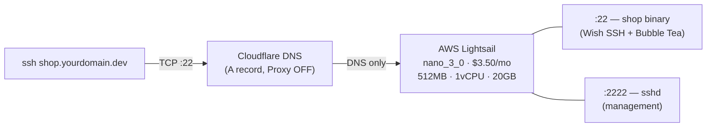

# shop.gyeongho.dev

> A terminal-based shop for all products gyeongho provides: games, embedded devices, devtools, and more.

## Quick start

- **Run TUI locally**: `make build && ./bin/shop` or `go run ./cmd/shop`
- **Keys**: `a` Shop, `s` About, `d` FAQ, `c` Cart, Up/Down scroll, `q` quit
- **Access via SSH**: `ssh shop.gyeongho.dev` (when the host is deployed and the SSH service is running). No extra login step; you get the same shop TUI in your terminal.

**Prerequisites**: Go 1.21+, Make.

## Running the SSH server locally

To run the shop as an SSH server on your machine (e.g. for development):

1. Build: `make build`
2. Start the server: `sudo ./bin/shop --ssh` (listens on port 22; host key at `.ssh/id_ed25519`, created if missing)
3. From another terminal: `ssh -o StrictHostKeyChecking=no -o UserKnownHostsFile=/dev/null localhost`

You can also set `SHOP_SSH=1` and run `./bin/shop` to start in SSH mode without the `--ssh` flag.

## Develop

- **Build and run SSH server locally**: `make build && sudo ./bin/shop --ssh` (listens on port 22; host key at `.ssh/id_ed25519`, created if missing).
- **Connect**: `ssh -o StrictHostKeyChecking=no -o UserKnownHostsFile=/dev/null localhost`
- **Run tests** (including SSH testsession tests): `make test`. SSH-related tests are in `tests/ssh/` (connect, full flow view-product-and-add-to-cart, failure).

## Deploy your own shop

This project deploys to AWS Lightsail ($3.50/mo). You'll need:

- [Terraform](https://developer.hashicorp.com/terraform/install) >= 1.0
- [AWS CLI](https://aws.amazon.com/cli/) configured (`aws configure`)
- A domain managed in Cloudflare (or any DNS provider)
- An SSH key pair for Lightsail instance access

### Prerequisites: AWS credentials and SSH key

#### 1. Create an IAM user for Terraform

Terraform needs AWS credentials with Lightsail permissions.

1. Go to [AWS IAM Console](https://console.aws.amazon.com/iam/) → **Users** → **Create user**
2. User name: `shop-terraform` (or any name you prefer)
3. Create and attach a custom IAM policy with Lightsail full access:
   ```json
   {
       "Version": "2012-10-17",
       "Statement": [
           {
               "Effect": "Allow",
               "Action": ["lightsail:*"],
               "Resource": "*"
           }
       ]
   }
   ```
4. Go to the user → **Security credentials** → **Create access key**
5. Select **Command Line Interface (CLI)** → **Create**
6. Save the **Access key ID** and **Secret access key**

Configure the AWS CLI with these credentials:

```bash
aws configure
# AWS Access Key ID: <paste access key>
# AWS Secret Access Key: <paste secret key>
# Default region name: ap-northeast-2
# Default output format: json
```

> You can also use a [named profile](https://docs.aws.amazon.com/cli/latest/userguide/cli-configure-profiles.html) and set `AWS_PROFILE` before running Terraform.

#### 2. Create an SSH key pair for deployment

This key is used to SCP the binary and manage the instance via port 2222.

```bash
# Generate a key pair (if you don't have one)
ssh-keygen -t ed25519 -C "shop-deploy" -f ~/.ssh/shop-deploy

# Register the public key with Lightsail
aws lightsail import-key-pair \
  --key-pair-name shop-deploy \
  --public-key-base64 "$(cat ~/.ssh/shop-deploy.pub)"
```

Then add the key pair name to your `infra/terraform.tfvars`:

```hcl
key_pair_name = "shop-deploy"
```

> Lightsail also creates a **default key pair** per region that you can download from the console. If you prefer that, skip this step — the default key will be used automatically.

#### 3. GitHub Actions secrets (for Terraform Plan CI)

If you want the Terraform Plan workflow to run on PRs, add these secrets in your GitHub repo → **Settings** → **Secrets and variables** → **Actions** → **New repository secret**:

| Secret | Value | How to get it |
|--------|-------|---------------|
| `AWS_ACCESS_KEY_ID` | Access key from step 1 | IAM Console → User → Security credentials |
| `AWS_SECRET_ACCESS_KEY` | Secret key from step 1 | Shown once at creation time |

These are only needed for the CI workflow. Local `make infra-*` commands use your `aws configure` credentials.

### Architecture



### 1. Provision infrastructure

```bash
# Initialize Terraform
make infra-init

# Preview changes
make infra-plan

# Create Lightsail instance + static IP
make infra-apply
```

Terraform will output the **static IP**. Add an A record in your DNS provider:

| Name | Type | Value | Proxy |
|------|------|-------|-------|
| `shop` | A | `<static IP from output>` | OFF (DNS only) |

> SSH is TCP — HTTP proxies like Cloudflare's orange cloud won't work. Use DNS only mode.

### 2. Deploy the app

```bash
# Build for Linux, upload to Lightsail, restart service
make deploy
```

This single command will:
1. Cross-compile the Go binary for Linux AMD64
2. SCP the binary to the Lightsail instance via port 2222
3. Restart the `shop.service` systemd unit

### 3. Verify

```bash
# Test shop access
ssh shop.yourdomain.dev

# Check service status
make deploy-status

# View logs
make deploy-logs
```

### What the instance runs

The `infra/user_data.sh` script configures the instance on first boot:

- Moves system sshd to port **2222** (frees port 22 for the shop)
- Creates a dedicated `shop` user with a systemd service (`shop.service`)
- Enables UFW firewall (22 public, 2222 restricted)
- Installs fail2ban for brute-force protection on port 2222

### Customization

Edit `infra/variables.tf` to change:

| Variable | Default | Description |
|----------|---------|-------------|
| `aws_region` | `ap-northeast-2` | AWS region |
| `instance_name` | `shop-terminal` | Lightsail instance name |
| `admin_ssh_allowed_cidrs` | `["0.0.0.0/0"]` | IPs allowed on port 2222 |

### Tear down

```bash
make infra-destroy
```

## Commands (Makefile)

| Target                    | Description                            |
| ------------------------- | -------------------------------------- |
| `make format`             | Format Go code (gofmt)                 |
| `make build`              | Build binary to `bin/shop`             |
| `make build-linux`        | Cross-compile for Linux AMD64          |
| `make test`               | Run tests                              |
| `make pre-commit-install` | Install pre-commit hooks               |
| `make deploy`             | Build + upload + restart (full deploy) |
| `make deploy-status`      | Check production service status        |
| `make deploy-logs`        | View production logs                   |
| `make deploy-ssh`         | SSH into Lightsail instance            |
| `make infra-init`         | Initialize Terraform                   |
| `make infra-plan`         | Preview infrastructure changes         |
| `make infra-apply`        | Create/update infrastructure           |
| `make infra-destroy`      | Destroy all infrastructure             |
| `make infra-output`       | Show Terraform outputs (static IP)     |

## Project layout

```
cmd/shop/            # TUI + SSH server entrypoint (--ssh for server mode)
internal/model/      # Domain (Product, Cart, Order, StoreInfo, FAQ)
internal/apiclient/  # API client interface + mock + HTTP
internal/sshsrv/     # Wish SSH server + shop TUI handler
internal/tui/        # Bubble Tea app, header, footer, pages
tests/unit/          # Unit tests
tests/integration/   # Integration tests
tests/ssh/           # Wish testsession tests (connect, failure)
```

## Inspiration

Inspired by [terminal.shop](https://terminal.shop), this project brings the charm of retro terminal interfaces to gyeongho's shop. Buy games, devices, devtools, and more from the terminal.
